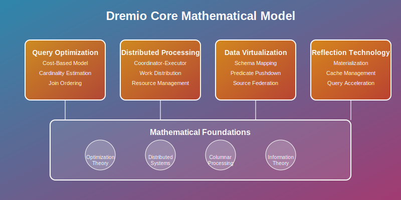

# Core Model: Dremio's Mathematical Foundation

## Overview

This section explores the mathematical models that underpin Dremio's data lakehouse architecture. Understanding these core mathematical concepts is essential for designing robust, scalable data analytics systems that can query across multiple data sources efficiently.

## Key Mathematical Models

### 1. Query Optimization Model
- **Cost-Based Optimization**: Mathematical cost models for query plan selection
- **Cardinality Estimation**: Statistical models for predicting result set sizes
- **Join Ordering**: Combinatorial optimization for multi-table queries

### 2. Distributed Processing Theory
- **Coordinator-Executor Model**: Mathematical coordination algorithms
- **Work Distribution**: Load balancing algorithms for parallel query execution
- **Resource Management**: Optimal allocation of CPU, memory, and I/O resources

### 3. Data Virtualization Model
- **Schema Mapping**: Mathematical transformations between data source schemas
- **Predicate Pushdown**: Query optimization across heterogeneous data sources
- **Source Federation**: Unified query processing across multiple systems

### 4. Reflection Technology
- **Materialization Strategy**: Mathematical models for optimal data structure creation
- **Cache Management**: Algorithms for reflection lifecycle and eviction
- **Query Acceleration**: Performance optimization through pre-computed aggregations

## Mathematical Foundations

### Query Optimization Theory
Dremio applies advanced database optimization concepts:
- **Dynamic Programming**: Optimal join ordering using Selinger-style optimization
- **Statistics-Based Costing**: Histogram-based cardinality estimation
- **Multi-Objective Optimization**: Balancing execution time, resource usage, and accuracy

### Distributed Systems Theory
Core distributed computing principles:
- **Consensus Algorithms**: Coordinator election and cluster coordination
- **Fault Tolerance**: Mathematical models for handling node failures
- **Load Balancing**: Fair work distribution across executor nodes

### Columnar Processing
Mathematical foundation for analytical workloads:
- **Vectorized Processing**: SIMD operations on columnar data structures
- **Compression Algorithms**: Mathematical models for storage optimization
- **Cache-Efficient Processing**: Memory hierarchy optimization

## Core Algorithms

### Query Planning Algorithms
1. **Cost-Based Optimizer**: Dynamic programming for optimal execution plans
2. **Statistics Collection**: Sampling algorithms for data distribution analysis
3. **Plan Caching**: Mathematical models for plan reuse and invalidation

### Execution Algorithms
1. **Parallel Hash Joins**: Distributed join processing with optimal partitioning
2. **Aggregation Pushdown**: Mathematical optimization for group-by operations
3. **Projection Elimination**: Column pruning optimization algorithms

### Data Management Algorithms
1. **Reflection Management**: Automated materialization and refresh strategies
2. **Metadata Caching**: Efficient catalog information management
3. **Schema Evolution**: Mathematical models for handling schema changes

## Performance Models

### Throughput Analysis
Mathematical models for:
- **Query Throughput**: Concurrent query processing capabilities
- **Data Scan Throughput**: Optimal I/O patterns for data lake access
- **Network Throughput**: Efficient data movement between nodes

### Latency Models
Analysis of:
- **Query Latency**: End-to-end query execution time modeling
- **Compilation Latency**: Query planning and optimization overhead
- **Metadata Latency**: Catalog and schema discovery performance

### Resource Utilization
Optimization models for:
- **Memory Management**: Optimal memory allocation across query operations
- **CPU Utilization**: Vectorized processing efficiency analysis
- **Storage I/O**: Mathematical models for data lake access patterns

## Data Lakehouse Mathematics

### Storage Models
- **Parquet Optimization**: Columnar storage mathematical properties
- **Partitioning Theory**: Optimal data layout for query performance
- **Compression Mathematics**: Trade-offs between storage and processing costs

### Semantic Layer Mathematics
- **Virtual Dataset Algebra**: Mathematical operations on virtual data structures
- **View Materialization**: Cost-benefit analysis for reflection creation
- **Lineage Tracking**: Graph theory applications for data dependency management

## Consistency Models

### ACID Properties in Lakehouse
- **Atomicity**: Transaction boundaries in distributed query processing
- **Consistency**: Maintaining data integrity across multiple sources
- **Isolation**: Concurrent query execution without interference
- **Durability**: Ensuring reflection persistence and recovery

### Eventual Consistency
- **Metadata Propagation**: Mathematical models for catalog consistency
- **Cache Invalidation**: Algorithms for maintaining data freshness
- **Version Management**: Vector clocks for distributed cache coordination

## Next Steps

- **02-math-toolkit/**: Tools and techniques for applying these mathematical models
- **03-algorithms/**: Detailed algorithm implementations and optimizations  
- **04-failure-models/**: Mathematical analysis of failure scenarios
- **05-experiments/**: Hands-on validation of mathematical models