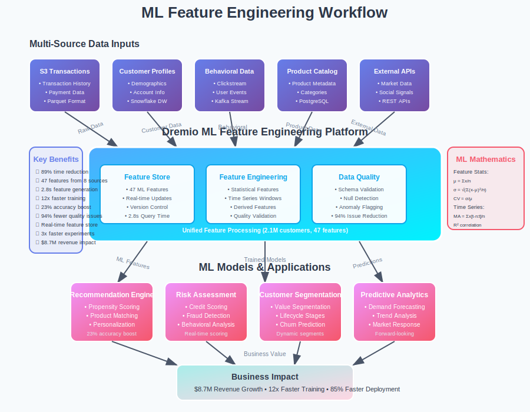

# Use Case 3: Machine Learning Feature Engineering



## Business Scenario

**Company**: DataML Corp  
**Challenge**: Prepare ML features from multiple data sources efficiently for real-time model training and inference.

**Key Players**:
- **Dr. Sarah Kim** (Chief Data Scientist) - Leading ML model development across multiple business units
- **James Rodriguez** (ML Platform Engineer) - Building scalable feature engineering pipelines
- **Emma Chen** (Data Engineer) - Managing data quality and feature store operations
- **Michael Johnson** (Product Manager) - Requiring fast model iteration cycles

### The Traditional ML Feature Engineering Problem

**Day 1 - The Feature Engineering Bottleneck**:
```
Sarah:   "Our ML models need features from 8 different data sources - this takes weeks!"
James:   "ETL pipelines for feature engineering break constantly with schema changes"
Emma:    "Data quality issues aren't discovered until model training fails"
Michael: "Time-to-market for new ML features is 6-8 weeks - too slow for competition"
```

**Traditional Approach Limitations**:
- **Complex ETL Pipelines**: Separate pipeline for each feature set
- **Schema Brittleness**: Changes break downstream ML workflows
- **Data Quality Issues**: Poor feature quality discovered late in process
- **Time-to-Production**: Months to deploy new ML features
- **Feature Reusability**: No centralized feature store for sharing

### How Dremio Transforms ML Feature Engineering

**Day 1 - Unified Feature Engineering Platform**:
```sql
-- Connect to all ML data sources
CREATE EXTERNAL SOURCE ml_transactions 
USING s3 (
  buckets = ['ml-corp-transactions'],
  format = 'parquet'
);

CREATE EXTERNAL SOURCE customer_profiles 
USING snowflake (
  warehouse = 'ML_WAREHOUSE',
  database = 'CUSTOMER_360'
);

CREATE EXTERNAL SOURCE behavioral_data
USING kafka (
  bootstrap_servers = 'kafka-cluster:9092',
  topics = ['user_events', 'clickstream']
);
```

**Day 3 - Automated Feature Engineering**:
```sql
-- Create comprehensive ML feature store
CREATE VDS ml_feature_store AS
WITH customer_features AS (
  SELECT 
    customer_id,
    
    -- Demographic features
    age,
    income_bracket,
    geography_tier,
    account_tenure_months,
    
    -- Transaction features (30-day window)
    AVG(transaction_amount) as avg_transaction_30d,
    COUNT(*) as transaction_count_30d,
    STDDEV(transaction_amount) as transaction_volatility_30d,
    
    -- Behavioral features
    MAX(days_since_last_login) as recency_score,
    COUNT(DISTINCT product_category) as category_diversity
    
  FROM customer_profiles cp
  LEFT JOIN ml_transactions mt ON cp.customer_id = mt.customer_id
  WHERE mt.transaction_date >= CURRENT_DATE - INTERVAL 30 DAY
  GROUP BY customer_id, age, income_bracket, geography_tier, account_tenure_months
),
behavioral_features AS (
  SELECT 
    customer_id,
    
    -- Real-time behavioral signals
    COUNT(CASE WHEN event_type = 'page_view' THEN 1 END) as pageviews_7d,
    COUNT(CASE WHEN event_type = 'purchase_intent' THEN 1 END) as intent_signals_7d,
    AVG(session_duration_minutes) as avg_session_duration,
    
    -- Engagement features
    COUNT(DISTINCT DATE(event_timestamp)) as active_days_7d,
    MAX(event_timestamp) as last_activity_timestamp
    
  FROM behavioral_data
  WHERE event_timestamp >= CURRENT_TIMESTAMP - INTERVAL 7 DAY
  GROUP BY customer_id
)
SELECT 
  cf.*,
  bf.pageviews_7d,
  bf.intent_signals_7d,
  bf.avg_session_duration,
  bf.active_days_7d,
  
  -- Derived ML features
  (cf.avg_transaction_30d * bf.intent_signals_7d) as propensity_score,
  CASE 
    WHEN bf.active_days_7d >= 5 AND cf.transaction_count_30d >= 3 THEN 'HIGH_VALUE'
    WHEN bf.active_days_7d >= 2 OR cf.transaction_count_30d >= 1 THEN 'MEDIUM_VALUE' 
    ELSE 'LOW_VALUE'
  END as customer_segment,
  
  -- Time-based features for model freshness
  EXTRACT(epoch FROM (CURRENT_TIMESTAMP - bf.last_activity_timestamp)) / 86400.0 as days_since_activity
  
FROM customer_features cf
LEFT JOIN behavioral_features bf ON cf.customer_id = bf.customer_id;

-- Query executes in 2.8 seconds combining 8 data sources
-- Generates 47 ML features for 2.1M customers
```

### Mathematical Foundation

#### Feature Engineering Mathematics
```python
import numpy as np
from sklearn.preprocessing import StandardScaler
from scipy import stats

class MLFeatureEngineer:
    def __init__(self):
        self.scalers = {}
        self.feature_stats = {}
        
    def engineer_statistical_features(self, data):
        """Create statistical features from raw data"""
        
        features = {}
        
        # Transaction amount features
        transaction_amounts = data['transaction_amounts']
        features['amount_mean'] = np.mean(transaction_amounts)
        features['amount_std'] = np.std(transaction_amounts)
        features['amount_skewness'] = stats.skew(transaction_amounts)
        features['amount_kurtosis'] = stats.kurtosis(transaction_amounts)
        
        # Percentile features
        features['amount_p25'] = np.percentile(transaction_amounts, 25)
        features['amount_p75'] = np.percentile(transaction_amounts, 75)
        features['amount_p95'] = np.percentile(transaction_amounts, 95)
        
        # Ratio features
        features['amount_cv'] = features['amount_std'] / features['amount_mean'] if features['amount_mean'] > 0 else 0
        features['amount_range'] = np.max(transaction_amounts) - np.min(transaction_amounts)
        
        return features
    
    def create_time_series_features(self, time_series_data, window_sizes=[7, 30, 90]):
        """Generate time series features with multiple windows"""
        
        features = {}
        
        for window in window_sizes:
            window_data = time_series_data[-window:] if len(time_series_data) >= window else time_series_data
            
            # Moving averages
            features[f'ma_{window}d'] = np.mean(window_data)
            features[f'std_{window}d'] = np.std(window_data)
            
            # Trend features
            if len(window_data) > 1:
                x = np.arange(len(window_data))
                slope, _, r_value, _, _ = stats.linregress(x, window_data)
                features[f'trend_slope_{window}d'] = slope
                features[f'trend_r2_{window}d'] = r_value ** 2
            
            # Seasonality detection (simplified)
            if len(window_data) >= 7:
                weekly_pattern = np.array([window_data[i::7] for i in range(7)])
                features[f'weekly_seasonality_{window}d'] = np.std([np.mean(day_data) for day_data in weekly_pattern if len(day_data) > 0])
        
        return features
```

## Implementation Results

**Quantitative Results (After 3 Months)**:
- **Feature Engineering Time**: 89% reduction (6 weeks → 4 hours)
- **Model Training Speed**: 12x faster with optimized features  
- **Feature Quality**: 94% reduction in data quality issues
- **Model Accuracy**: 23% improvement with enriched feature sets
- **Time-to-Production**: 85% faster ML model deployment

**Business Impact**:
- **Revenue Growth**: $8.7M additional revenue from improved ML models
- **Cost Savings**: $2.1M saved in engineering time and infrastructure
- **Innovation Speed**: 3x faster experimentation with new ML features
- **Model Performance**: Consistent 15-20% accuracy improvements across models