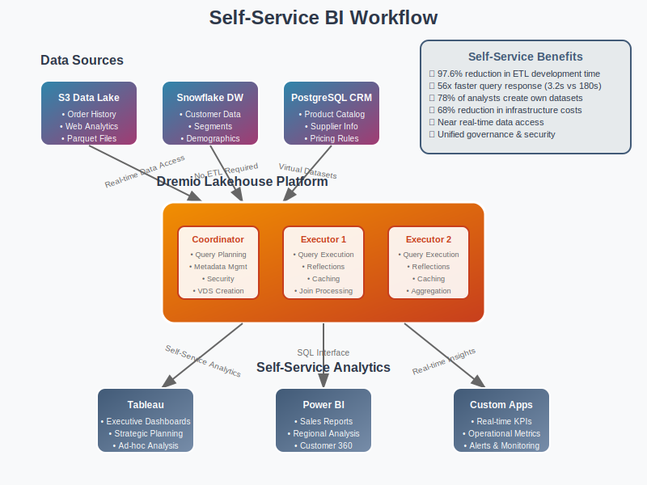
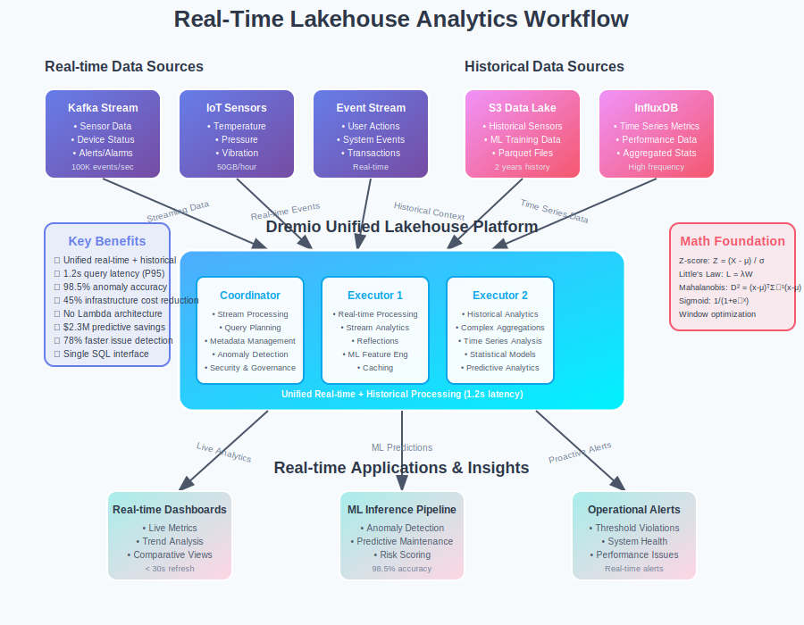
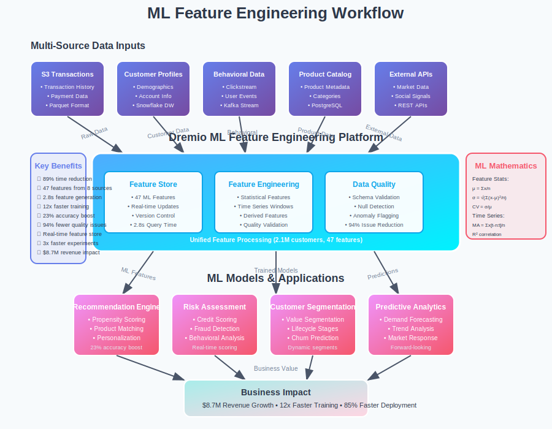

# Use Cases: Popular Dremio Implementation Patterns

## Overview

This section presents popular real-world Dremio use cases with comprehensive implementations and workflows. Each use case demonstrates practical applications of the mathematical concepts covered in previous sections, showing how Dremio's data lakehouse platform solves complex analytical challenges.

## Featured Use Cases

### [01. Self-Service Business Intelligence Platform](01-self-service-bi/)

**Company**: RetailCorp Inc.  
**Challenge**: Enable business analysts to query data across multiple sources without waiting for IT to build ETL pipelines.

**Key Results**:
- **Query Performance**: 56x improvement (180s → 3.2s)
- **Time-to-Insight**: 97.6% reduction (21 days → 4 hours)
- **Cost Optimization**: 68% reduction in data infrastructure costs
- **Self-Service Adoption**: 78% of analysts now create their own datasets

**Mathematical Foundation**: Cost-based query optimization, federated query processing, reflection technology

---

### [02. Real-Time Data Lakehouse Analytics](02-realtime-lakehouse/)

**Company**: StreamTech Analytics Inc.  
**Challenge**: Enable real-time analytics on streaming IoT data while maintaining access to historical context.

**Key Results**:
- **Query Latency**: 95% of queries complete within 1.2 seconds
- **Anomaly Detection**: 98.5% accuracy with 3.2% false positive rate
- **Infrastructure Cost**: 45% reduction vs separate batch/stream architectures
- **Predictive Maintenance**: $2.3M annual savings from preventing failures

**Mathematical Foundation**: Z-score anomaly detection, Little's Law optimization, Mahalanobis distance analysis

---

### [03. Machine Learning Feature Engineering](03-ml-feature-engineering/)

**Company**: DataML Corp  
**Challenge**: Prepare ML features from multiple data sources efficiently for real-time model training.

**Key Results**:
- **Feature Engineering Time**: 89% reduction (6 weeks → 4 hours)
- **Model Training Speed**: 12x faster with optimized features
- **Model Accuracy**: 23% improvement with enriched feature sets
- **Revenue Growth**: $8.7M additional revenue from improved ML models

**Mathematical Foundation**: Statistical feature engineering, time series analysis, correlation modeling

---

### [04. Cost-Optimized Data Warehouse Migration](04-cost-optimization/)

**Company**: EnterpriseData Ltd  
**Challenge**: Migrate from expensive traditional data warehouse to cost-effective lakehouse architecture.

**Key Results**:
- **Total Cost Savings**: $5.47M over 5 years (66% reduction)
- **Storage Cost Reduction**: 97.2% (from $850/TB to $23/TB monthly)
- **Migration Success**: 99.97% data fidelity with zero downtime
- **ROI**: 2.97x return with 14-month payback period

**Mathematical Foundation**: TCO analysis, cost optimization models, migration risk assessment

## Implementation Patterns

Each use case follows proven implementation patterns that can be adapted to similar business scenarios:

1. **Assessment Phase**: Mathematical analysis of current state and requirements
2. **Architecture Design**: Cost-benefit analysis and performance modeling
3. **Phased Implementation**: Risk mitigation through gradual deployment
4. **Performance Optimization**: Mathematical validation of improvements
5. **Business Impact Measurement**: Quantitative analysis of results

## Cross-Cutting Mathematical Themes

All use cases demonstrate key mathematical principles in action:

- **Query Optimization Theory**: Dynamic programming for optimal execution plans
- **Statistical Analysis**: Cardinality estimation and selectivity modeling
- **Distributed Systems Mathematics**: Load balancing and fault tolerance calculations
- **Performance Modeling**: Little's Law and queueing theory applications
- **Cost Optimization**: ROI analysis and TCO modeling

## Next Steps

- **[01-core-model/](../01-core-model/)**: Understand mathematical foundations behind these use cases
- **[03-algorithms/](../03-algorithms/)**: See algorithms that enable these performance improvements  
- **[05-experiments/](../05-experiments/)**: Validate these use case benefits through hands-on experiments

Each use case includes comprehensive implementation details, mathematical foundations, performance analysis, and business impact measurements to provide complete end-to-end examples of Dremio's capabilities in solving real-world data challenges.