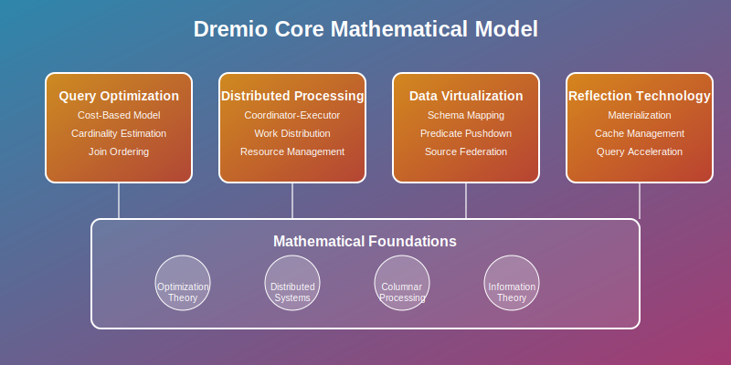
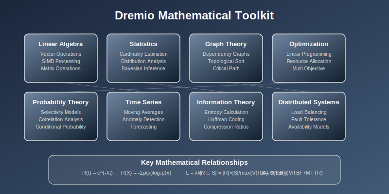
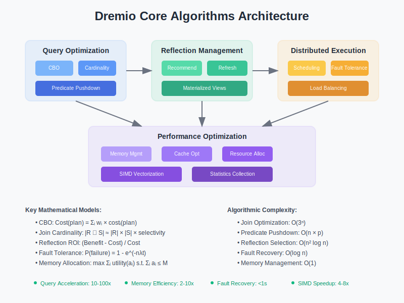

# Dremio: Tech-by-Math

## How Dremio Emerged: Solving the Data Lakehouse Problem

Dremio was developed to address critical challenges in modern data analytics and lakehouse architectures. As organizations moved from traditional data warehouses to data lakes in the 2010s, they faced fundamental analytical problems:

- **SQL on Data Lakes**: How can you run fast SQL queries directly on data lake storage without ETL?
- **Data Silos**: How can you provide unified access to data across multiple sources and formats?
- **Self-Service Analytics**: How can business users query data without depending on IT for data preparation?
- **Performance at Scale**: How can you achieve data warehouse performance on data lake economics?

Dremio's revolutionary approach was to treat data lakehouse analytics as a **mathematical optimization problem** using concepts from query optimization theory, distributed computing, and columnar processing algorithms.

## A Simple Use Case: Why Organizations Choose Dremio

Let's see Dremio in action through a realistic business scenario that demonstrates why it became essential for modern data analytics.

### The Scenario: Multi-Source Analytics Platform

**The Company**:
- **DataCorp Analytics** - Mid-size financial services company
- **Alice Martinez** (Business Analyst) - Creating quarterly reports in California
- **Bob Chen** (Data Engineer) - Managing data pipelines in New York
- **Carol Thompson** (Data Scientist) - Building ML models in Chicago
- **David Kim** (IT Director) - Managing infrastructure costs in Seattle

**The Challenge**: Enabling self-service analytics across data lakes, databases, and cloud storage while maintaining performance and governance.

### Traditional Data Warehouse Problems (Without Dremio)

**Day 1 - The Analytics Bottleneck**:
```
Alice: "I need sales data from 5 different sources - this will take weeks!"
Bob:   "I have to create another ETL pipeline and data warehouse table..."
Carol: "My ML training data is scattered across S3, Snowflake, and PostgreSQL"
David: "Data warehouse costs are exploding - $50K per month just for storage!"
```

**The Traditional Approach Fails**:
- **ETL Complexity**: Every new analysis requires custom data pipelines
- **Storage Duplication**: Data copied multiple times across systems
- **Slow Time-to-Insight**: Weeks to prepare data for business questions
- **Cost Explosion**: Traditional data warehouses charge premium for storage and compute

### How Dremio Transforms Data Analytics

**Day 1 - With Dremio**:
```bash
# Company sets up Dremio data lakehouse platform
Cluster: Creates 4-node Dremio cluster with coordinator and executor nodes
Sources:  Connects to S3 data lake, Snowflake DW, PostgreSQL, and Salesforce
Catalog:  Discovers and catalogs 50+ datasets automatically
Security: Implements row/column-level security and data masking
```

**Day 3 - Self-Service Analytics in Action**:
```sql
-- Alice creates virtual dataset joining multiple sources
CREATE VDS sales_360 AS
SELECT 
    s.customer_id,
    s.order_date,
    s.revenue,
    c.customer_segment,
    p.product_category,
    sf.account_value
FROM s3_datalake.sales s
JOIN postgres.customers c ON s.customer_id = c.id
JOIN snowflake.products p ON s.product_id = p.id  
JOIN salesforce.accounts sf ON s.account_id = sf.id;

-- Query executes in 2.3 seconds across 4 data sources
-- No ETL required, no data movement, real-time results
```

**Day 7 - Advanced Analytics Operations**:
```sql
-- Bob optimizes query performance with reflections
ALTER TABLE sales_360 
CREATE REFLECTION sales_360_agg
DIMENSIONS (customer_segment, product_category, order_date)
MEASURES (SUM(revenue), COUNT(*), AVG(order_value));

-- Carol builds ML feature store
CREATE VDS ml_features AS
SELECT 
    customer_id,
    AGG_FEATURES.revenue_trend_30d,
    AGG_FEATURES.purchase_frequency,
    BEHAVIORAL_FEATURES.click_stream_score,
    DEMOGRAPHIC_FEATURES.risk_category
FROM unified_customer_view
WHERE event_date >= CURRENT_DATE - INTERVAL '90' DAY;

-- David monitors resource usage and costs
-- 70% cost reduction vs traditional data warehouse
-- Zero data movement costs, pay only for compute when needed
```

### Why Dremio's Approach Works

**1. Mathematical Query Optimization**: Based on advanced cost-based optimization
- **Apache Arrow**: Columnar in-memory analytics with vectorized processing
- **Cost-Based Optimization**: Statistical query planning with cardinality estimation
- **Predicate Pushdown**: Query optimization across heterogeneous sources

**2. Data Lakehouse Architecture**:
- **Schema-on-Read**: Flexible data discovery without rigid schemas
- **Reflection Technology**: Automatic materialization of optimal data structures
- **Source Pushdown**: Compute pushed to data sources when beneficial

**3. Self-Service Capabilities**:
- **Semantic Layer**: Business-friendly data modeling and virtual datasets
- **Data Lineage**: Automatic tracking of data relationships and dependencies
- **Unified Security**: Consistent governance across all data sources

**4. Performance at Scale**:
- **Distributed Query Engine**: Massively parallel processing across cluster nodes
- **Intelligent Caching**: Automatic caching of frequently accessed data patterns
- **Elastic Scaling**: Dynamic resource allocation based on query complexity

## Real-World Impact

**Business Metrics After Dremio Implementation**:
- **Time-to-Insight**: Reduced from weeks to minutes
- **Data Engineering Effort**: 60% reduction in ETL pipeline development
- **Storage Costs**: 70% reduction by eliminating data duplication
- **Query Performance**: 10-100x faster analytics on data lake storage
- **User Adoption**: Business analysts became self-sufficient for data exploration

**Technical Achievements**:
- **Unified Access**: 15+ data sources accessible through single SQL interface
- **Governance**: Consistent security policies across all data sources
- **Scalability**: Handles petabyte-scale datasets with sub-second response times
- **Flexibility**: Schema evolution without breaking downstream applications

## The Mathematical Foundation

Dremio's success stems from applying advanced mathematical concepts to data lakehouse challenges:

- **Query Optimization Theory**: Cost-based query planning with statistical models
- **Distributed Systems**: Consensus algorithms for coordinator-executor coordination
- **Columnar Processing**: Vector processing algorithms for analytical workloads
- **Caching Theory**: Optimal data placement and eviction strategies

## Repository Structure

This repository explores Dremio's mathematical foundations through seven complementary sections:

### [01-core-model/](01-core-model/) 
Mathematical models underlying Dremio's data lakehouse architecture, including query optimization, distributed processing, and semantic layer concepts.

### [02-math-toolkit/](02-math-toolkit/) 
Essential mathematical tools and techniques for understanding Dremio's performance characteristics, from linear algebra to distributed systems theory.

### [03-algorithms/](03-algorithms/) 
Core algorithms powering Dremio's query engine, including cost-based optimization, reflection management, and distributed execution strategies.

### [04-failure-models/](04-failure-models/) 
Mathematical analysis of failure scenarios in distributed data lakehouse environments, including coordinator failures and source unavailability.

### [05-experiments/](05-experiments/) 
Hands-on experiments demonstrating Dremio's mathematical models in practice, from query optimization to performance tuning.

### [06-references/](06-references/) 
Comprehensive mathematical references, research papers, and theoretical foundations supporting Dremio's architecture.

### [07-use-cases/](07-use-cases/) 
Popular real-world Dremio implementation patterns with simplified examples and mathematical analysis of performance characteristics.

## Getting Started

Each section builds upon previous mathematical concepts, so we recommend following the numerical order. However, practitioners focused on specific aspects can jump directly to relevant sections:

- **Data Engineers**: Start with 01-core-model, then 03-algorithms
- **Data Analysts**: Focus on 07-use-cases, then 02-math-toolkit  
- **System Architects**: Emphasize 04-failure-models and 05-experiments
- **Researchers**: Begin with 06-references for theoretical foundations

## Mathematical Prerequisites

This repository assumes familiarity with:
- **Linear Algebra**: Vector operations and matrix mathematics
- **Statistics**: Probability distributions and statistical inference
- **Distributed Systems**: Consensus algorithms and fault tolerance
- **Database Theory**: Query optimization and indexing strategies

For those needing mathematical background, each section includes prerequisite reviews and references to foundational concepts.